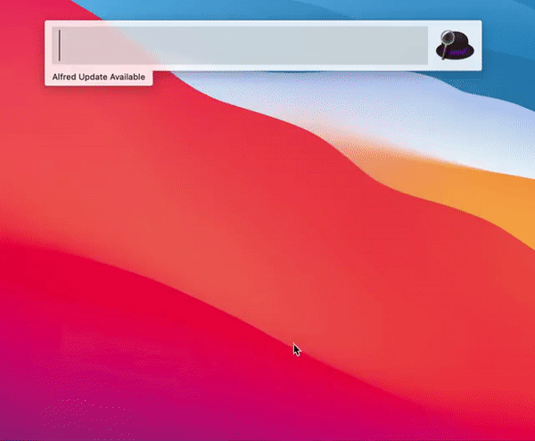
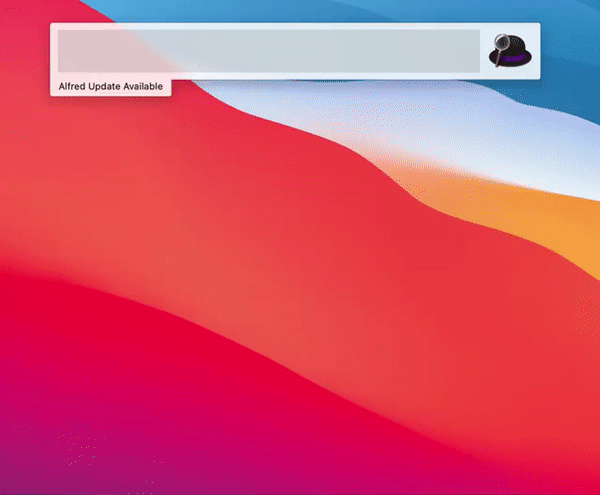

# Daily-RSS-Feed-Reader
An alfred workflow to display content of RSS feeds Directly.

---

## Install
- Download `Daily.RSS.Feed.Reader.alfredworkflow` from [release](https://github.com/PYF0311/Daily-RSS-Feed-Reader/releases/tag/v1.0.0).
- Double click to import.

## Features
- Directly display the content of RSS feeds.
- Easy to manage RSS sources.

## Instructions
- ``rss`` : Display the contents from all RSS feeds

  

  

- ``rss [source_name] `` : Display the contents from certain RSS feed. eg: rss sspai 

  

- ``rss help`` : Display all available commands

  

- rss open : Open ``config.json`` to manage RSS feeds

  

